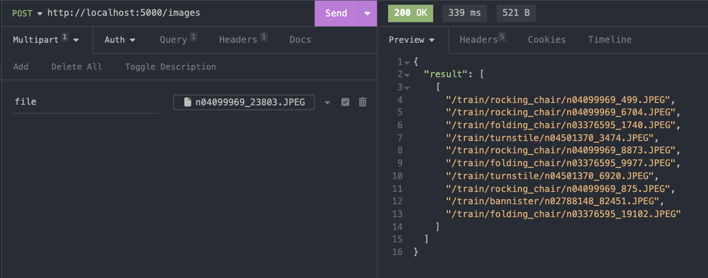
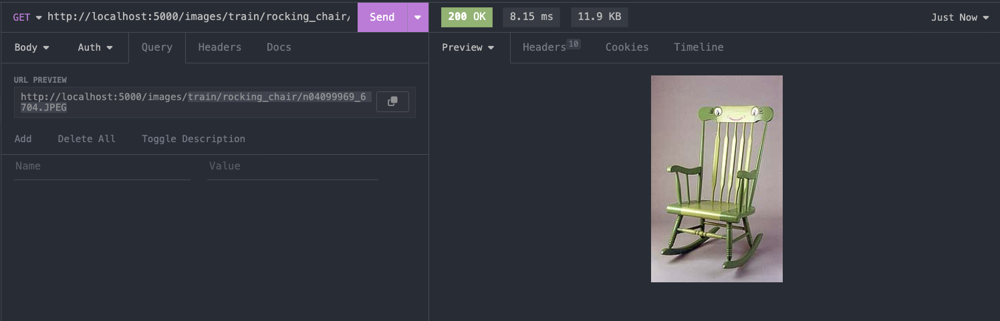
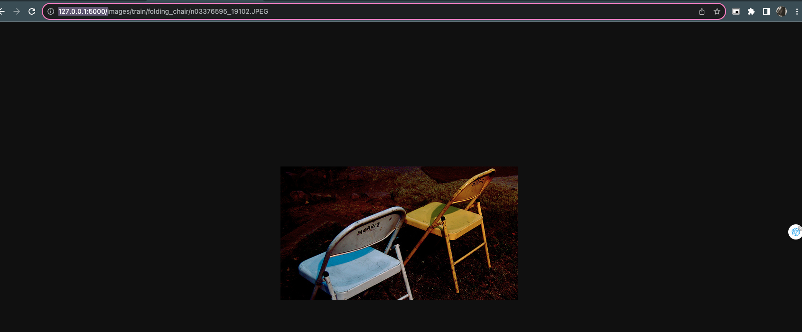
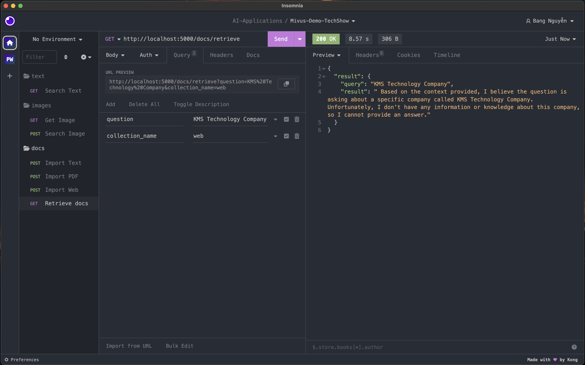
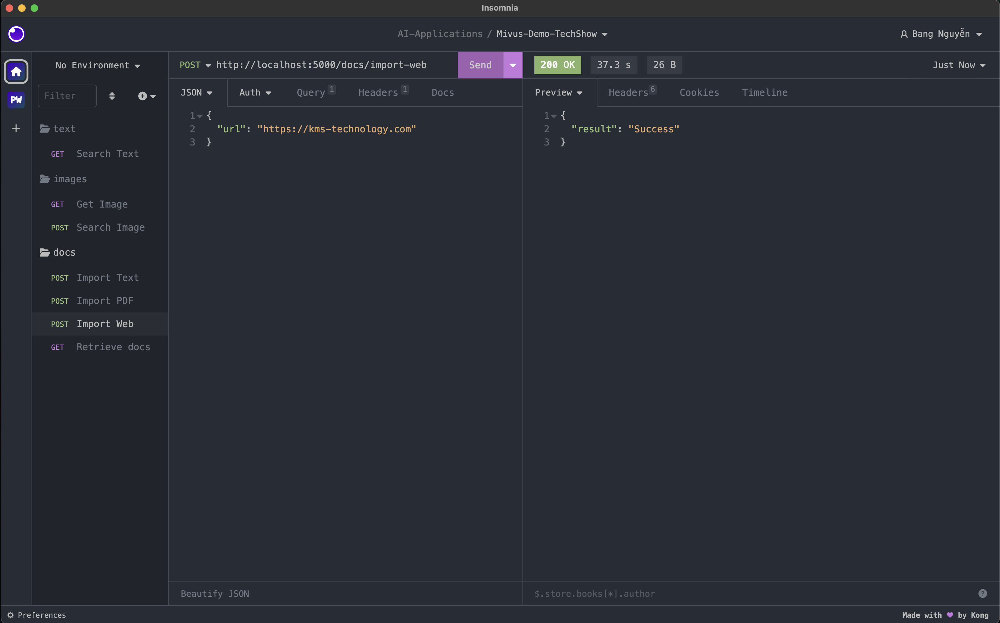
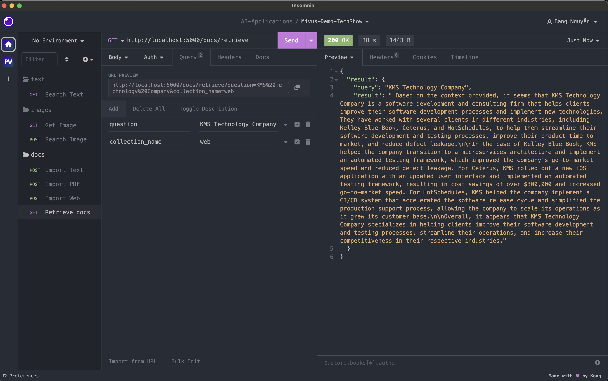

# 1. Start Flask application
```bash
 flask --app flaskr run --debug
```

# 2. Set up Vector Database
In root directory, run:
```bash
docker-compose up
```

# 3. Set up data for text search
- Create python virtural env
- Activate that virtaul env
- pip install pipenv
- cd backend
- pipenv install
- Go to flaskr/utils/import_text_data.ipynb
- Run step by step to pull and insert data into Milvus

# 4. Test Text Search API
URL: http://localhost:5000/text
Query Param: text

# 5. Set up data for image search
- Go to flaskr/utils/import_image_data.ipynb
- Run step by step to pull and insert image data into Milvus

# 6. Test Image Search API
## 6.2 Search
- Method: POST
- URL: http://localhost:5000/images
- Multipart Form Data Field: file

## 6.2 Ser Image
- Method: GET
- URL: http://localhost:5000/images/<image_path>


## 6.3 Note
- In Insomnia you can use 'http://localhost:5000' to access backend
- But on browser, must use http://127.0.0.1:500 


# 7. Chat with our docs
## 6.1 Set up
- Update python packages:
    ```bash
    pipenv install
    ```
- Ollama -> run LLM (Llamma2) locally
    - Install Ollama https://github.com/jmorganca/ollama
    - Pull llama2
    - Start Ollama
## 6.2 Some info:
- pdf:
    + Milvus Collection: pdf
    + Import PDF docs:
        - Method: POST
        - URL: http://localhost:5000/docs/import-pdf
        - Multipart Form Data Field: file
- txt
    + Milvus Collection: txt
    + Import txt docs:
        - Method: POST
        - URL: http://localhost:5000/docs/import-txt
        - Multipart Form Data Field: file
- web
    + Milvus Collection: web
    + Import web docs:
        - Method: POST
        - URL: http://localhost:5000/docs/import-web
        - JSON Body Data: { "url": "https://kms-technology.com" }
- Retrieve docs:
    - Method: POST
    - URL: http://localhost:5000/docs/retrieve
    - Query Params:
        + question: string
        + collection_name: string (must be one of ['txt', 'pdf', 'web'])
## 6.3 Test Web Docs
- Retrieve before emdeding docs

- Import docs from web url

- Retrieve kms info

## 6.4 Test PDF
## 6.5 Test Txt